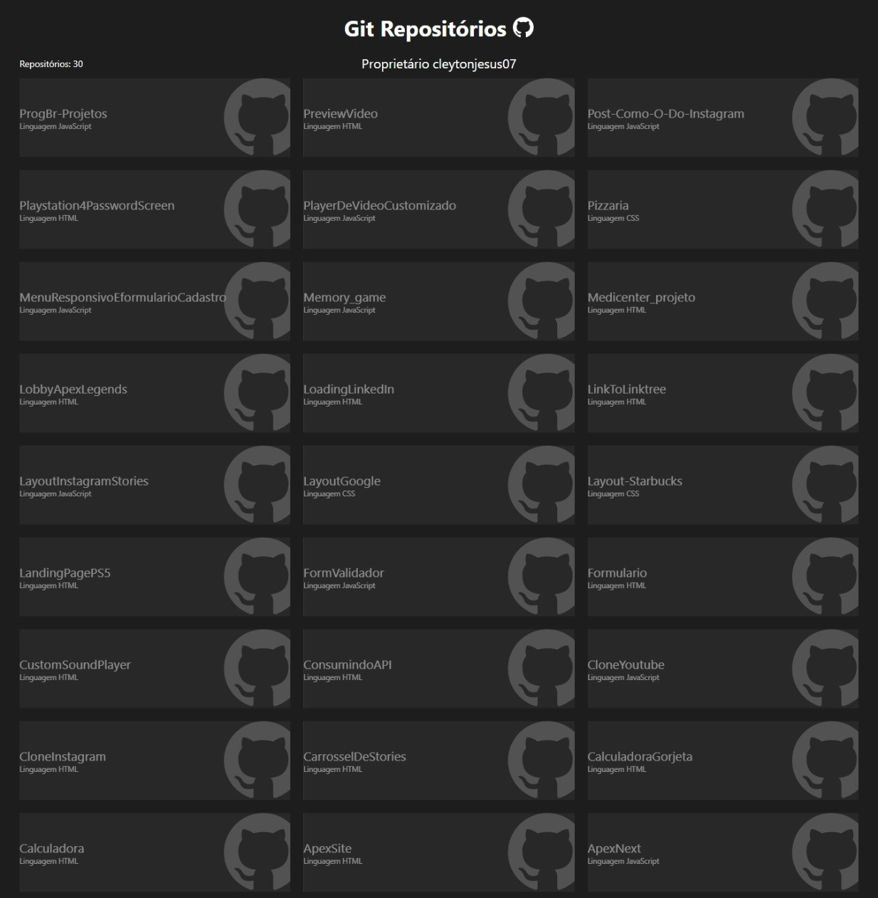

<h1>Git repositórios</h1>

<h3>Sobre :</h3>

Uma listagem dos meus repositórios no Github.

<h3>Imagem :</h3>

<h3>Ver o projeto :</h3>
<a href="https://cleytonjesus07.github.io/consulta-dos-repositorios/">Link para o projeto: Git repositórios.</a>

